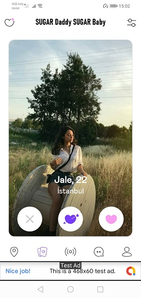
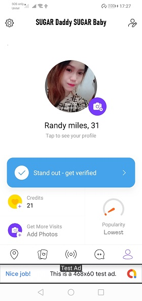
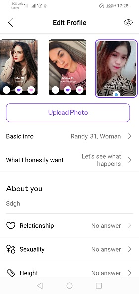
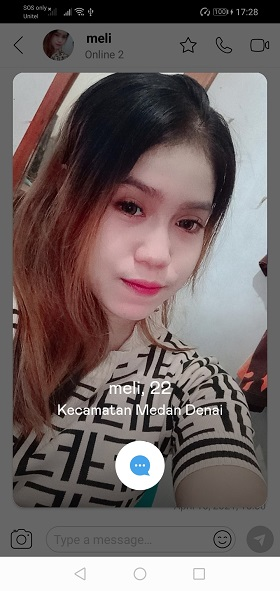
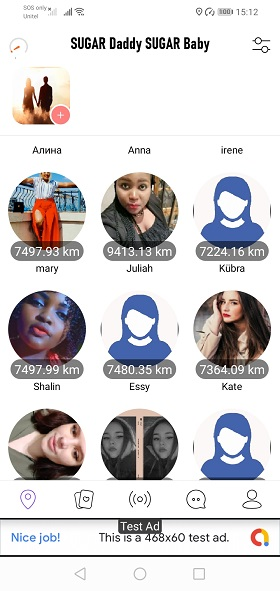
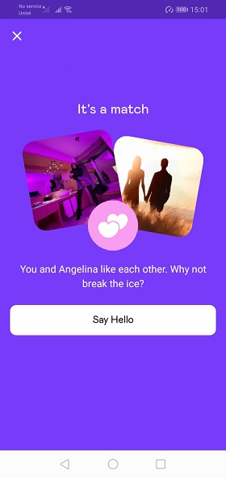
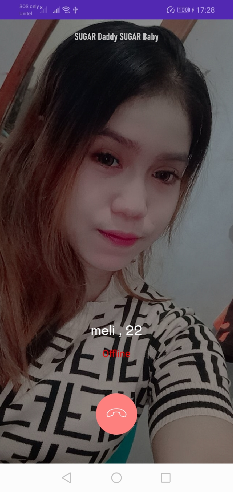
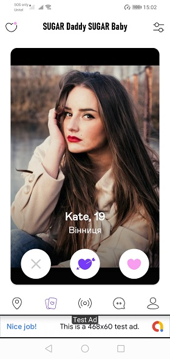

# SugarDaddy

A) Setup Backend 
This platform uses Parse Serever for backend.
You have several options on how to get Parse Server as BaaS or install your Self-hosted Parse Server.

## Screenshot

|                Screenshot               | Screenshot |
|:---------------------------------------:|:-------------------------------------:|
|    |      |

- Cloud Services: There are several companies offering Parse Server.
• Back4app (Recommended)
• SashiDo
• Glitch
• Flynn

- Whatever your choice between BaaS or Self-hosted Parse Server, please get App Id, Client Key and Master Key. Save all for later use.

* IMPORTANT: PUSH NOTIFICATIONS: It's not safe to send push notifications via client side, you need to upload main files to Parse Cloud Code.

• Open source folder.
• Open cloud_code folder.
• Upload main.js file to your Parse Server Cloud code location.

## Screenshot

|                Screenshot               | Screenshot |
|:---------------------------------------:|:-------------------------------------:|
|    |      |

B) Setup Agora.io 
This platform uses Agora.io For Calls and Live Stream.
With Agora.io you have FREE 10.000 Minutes / Month for Calls and LiveStream.
Follow these steps to Get Agora API key.
• Go to Agora.io
• Sign Up or Login
• Create new Project
• Go to Project setting and Get App Id. Save it for later use.

C) Setup Firebase 
This platform uses firebase.com for Push notifications, Monitoring, Analytics and Crashlytics
Go to Firebase developer console and Create a project.

## Screenshot

|                Screenshot               | Screenshot |
|:---------------------------------------:|:-------------------------------------:|
|    |      |

• Click in add app
• Choose android
• add your desired app package
• Register an app and download a .json file. Save it for later use.

D) Setup Facebook Login
This platform has Facebook Login feature Facebook Developer To get data from User facebook, Photos or just to link.
Go to Facebook developer Login or Signup.

• Select Facebook Login product and click the Set Up.
• Select Android as the App platform.
• Add key hash for release and debug. *
• Click the Save button.
• Copy facebook_app_id and fb_login_protocol_scheme the Save for later use..

* You need to Generate Key hash for facebook Login to work.

## Screenshot

|                Screenshot               | Screenshot |
|:---------------------------------------:|:-------------------------------------:|
|    |      |

D) Setup Instagram App 
This platform uses Instagram Developer To get User's instagram photos.
Go to Facebook developer Login or Signup.

• Select Instagram product and click the Set Up.
• Go to Basic Display.
• Scroll Down and Click in Create new App set name and create.
• Set App Name and Save.
• Copy Instagram App ID and Instagram App Secret the Save for later use.

E) Setup Google Places 
This platform uses Google Places API to search for locations in filter.
Go to Google Cloud Platform Console. Login or Signup.

• Click the project drop-down and select or create the project for which you want to add an API key.
• Click the menu button and select APIs & Services > Credentials.
• On the Credentials page, click Create credentials > API key.
• The API key created dialog displays your newly created API key.
• Save it for later use and Click Close.
• The new API key is listed on the Credentials page under API keys.

* REMEMBER: Restrict the API key before using it in production. Check how to fo it.

F) Setup Google Play Purchases 
This platform uses Google Play Payments to charge users who needs to purchase extra features or credits.

a) Setup Market API KEY
Go to your Google Play Developer Console (Google Play Publish).
Select your application in the list or create a new app.
Go to Services & APIs.
Copy YOUR LICENSE KEY FOR THIS APPLICATION and Save it for later use.

b) Setup In-App Purchases
This platform uses Managed and Subscriptions in-app purchases, you can use your rules butwe recommend to follow our rules.

Consumable: 100 credits, 550 credits, 1250 credits, 2750 credits
Subscriptions: 1 week, 1 month, 3 months, 6 months
Create your in-app purchases to and save their ProductIDs for later use

• n-app Products
• Add new product
• set the product id and type (Managed or Subscription)
• Fill the form and set the price you want and Save.
• You need to create products individually, remember to save all products Ids for later use.

D) Admob Setup
THis platform uses Google Admob to show Ads and Rewarded Video
Go to Admob developer Login or Signup

• Click Apps in the sidebar.
• Select App or Create new.
• Click the icon in the App ID column
• Copy the ID of an app.
• Save for later use
• Now create your ads for Home and Rewarded Video

Click Apps in the sidebar.
Select the name of the app you're creating this ad unit for. ...
Click Ad units in the sidebar.
Click Get started.
Click Select for the Banner or Rewarded Video ad format.
Enter a name for this ad unit.
Save and get ID.
Now, sabe ID for Later use.

G) Android App Import 
Android version was developed with Java for Android, for that you need Android Studio
Click on Import project (Eclipse ADT, Gradle, Etc)
Extract and Navigate to qilu_android folder
Click in OK or import
Wait for Android Studio to load setup all files and dependencies.

G) Application Setup
Do you remember this word Save it for later use ? if yes, then everything you saved it's now time to use them
Copy google-services.json you downloaded from Firebase and paste it in ./app folder. App and json file package names must be the same

Then go to res -> strings.xml and change bellow values from ones you saved before

Change your app_name: Your desired name
Change your facebook_app_id: Your facebook App ID
Change your fb_login_protocol_scheme: fb+ your facebook app ID
Change your google_api_key_geo: Google Places API key
Change your gcm_sender_id: Firebase Sender ID and Project ID
Change your admob_app_id: Admob App ID
Now go to app -> Config.java and change bellow values from ones you saved before

Change your SERVER_URL: Your Parse Server URL
Change your LIVE_QUERY_URL: Your Parse LiveQuery URL
Change your SERVER_API_KEY: Your ParseApp API key
Change your SERVER_CLIENT_KEY: Your ParseApp CLIENT key
Change your AGORA_APP_ID: Agora Project App ID (Agora.io)
Change your INSTAGRAM_APP_ID: Instagram App Id
Change your INSTAGRAM_APP_SECRET: Instagram App Secret
Change your INSTAGRAM_REDIRECT_URI: Instagram Redirect URIs
Change your HOME_BANNER_ADS: your ads unit Id for Home
Change your REWARDED_ADS: your ads unit Id for rewarded video
You also can change CREDIT_100, CREDIT_550, CREDIT_1250, CREDIT_2750 and SUBS_1_WEEK, SUBS_1_MONTH, SUBS_3_MONTHS, SUBS_6_MONTHS if you used your own Products Ids.

H) App Customization 
If you want to customize colors you can change it directly in res-> colors.xml file.
If you want to customize App name and names reference you can change it directly in res-> string.xml file.
To change your package name check this link
For general customization for example to Disable or Enable Ads, Premium or others app -> Config.java file.
When you change the package name, please double in AndroidManifest.xml and manually change any old package name reference, especial for Parse Push Section.
